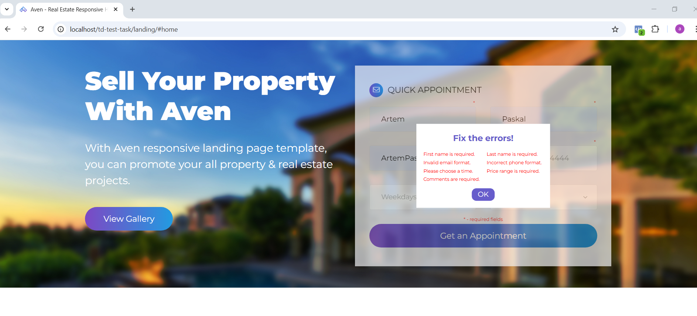
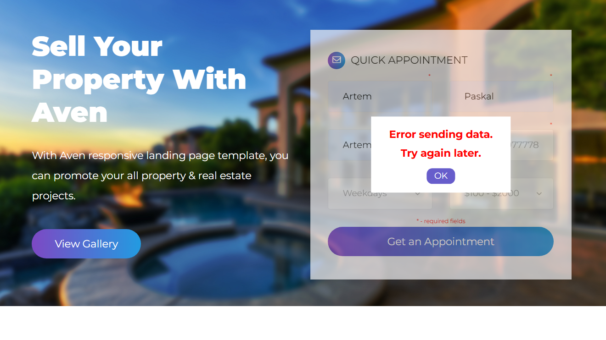

# Тестове завдання інтегратор

Для запуску проекту вам знадобиться сервер, який підтримує роботу з PHP. Ви можете скористися
будь-яким, ми ж розглянемо на прикладі МАМР. Треба скачати його з офіційного сайту та встановити 
собі на компютер. Якшо не змінювати базові налаштування то він буде доступний за адресою
***C:\MAMP\htdocs***. В цю папку вам потрібно скачати даний репозиторій. Шоб запустити його, вам треба
увімкнути сервер натиснувши на кнопку на панелі MAMP, потім перейдіть в браузер та в пошук введіть адресу репозиторію, від буде доступний за адресою ***http://localhost/td-test-task/landing/***.

### Пройдемся по структурі проекту:

 - ***landing*** - папка в якій знаходиться код основної сторінки завдання 

 - ***server*** - папка з api.php обробником який оброляє нашу форму, та всі файли що стосуються серверної  частини, бази даних, файли логування, тощо.
 1. ***api.php*** - обробник який визивається при submit форми
 2. ***requests.log*** - файл з логами, зверненнями до нашого серверу та відповідями
 3. ***database.sqlite*** - наша база даних, яка зберігає дані заповнені в формі
 4. ***createTableDB.php*** - файл який створює таблиці в нашій базі даних(використовувати не треба, база даних вже буде зі створеними таблицями та з тестовими даними)
 5. ***showDB.php*** - ***http://localhost/td-test-task/server/showDB.php*** - якшо запустит в браузері можна подивитися вміст нашої бази даних

 - ***success*** - папка в якій знаходиться сторінка, на яку нас перекидує в разі успішного виконання форми

- ***removed-elements-list.md*** - опис файлів які були видалені(завдання №2)
- ***landing/js/bugFix.js*** - файл який виправляє помилки не валідної верстки з меню, хедером
Також був випралений баг завантаження сторінки повязаний з лоадером в файлі  ***custom.js***

### Опис проекту 

По завданню перш за все нам потрібно зробити валідацію на стороні клієнта. За це відповідальний 
файл **landing/js/submitHandler.js**. Перевіряється валідність введених даних, встановлені обовязкові
поля такі як Імя, Прізвище, Телефон, та Час бронювання. Також додана маска на телефону. Коли юзер натискає кнопку Submit, відпраляється запит. Перш за все ми затемняємо форму, та вмикаємо лоадер - як сигнал шо йде звернення до серверу, на сервері імітація за допомогою sleep(1). Якшо перевірка не пройдена ми повертаємо спочатку відповідь зі сторони клієнта шо треба виправити помилки. 

Якщо всі перевірки пройдені тоді ми відправляємо запит до нашого серверу ***server/api.php***.
При успішній відповіді нас перекидає на сторінку ***Success/index.html***.
При відмові нам на фронтенд в форму знову прилітає повідомлення з помилки.
Повідомлення ми можемо скіпнути - натиснувши на кнопку ОК, та ввести валідні дані.
Також при успішному виконані форми ми ініціюємо подію *success*, що є тригером для 
відправлення Facebook и Google Analytics - код в хед нашої сторінки (Завдання №1)

###  Опис обробника api.php

Файл api.php виконується після успішних перевірок даних на клієнті. Основні функції 
- валідація на стороні серверу отриманих даних
- в разі успішної перевірки відправляє повідомлення success, зі сторінкою редіректу
- в разі не успішної - повідомлення з помилкою на клієнт
- також є функція збору геоданих клієнта (використаний безкоштовний зовнішній API, api_key діє
до 1.12.2024, будьте уважні)
- обробник збирає дані форми та геодані та записує в файл логуванн - requests.log
- також дані записуються в базу даних **database.sqlite**, схема якої в createTableDB.php.
Є дві таблиці User and Messages. Унікальне значення юзера - номер телефону.
- можна подивитися вміст бази даних в файлі - **showDB.php** - опис є вище
- є засихт XSS, CSRF и SQL-інєкцій.

###  Интеграция и настройка фронтенда:
  
  Завдання по фронтенду я виконав в папці **success**. Я зверстав шаблон  - responsive - 
  який гарно виглядає на всіх типах девайсів. Реалізував базові речі, можливо трохи десь 
  не коректно за браком часу. Маю 2 роки досвіду фронтенд розробником, якщо було б більше часу
  більш старанно б виконав завдання. 

Перепрошую за граматичні помилки))))

